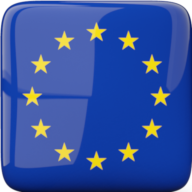

# EUnions
Application pull the some interesting information from Internet about countries
of European Union and Schengen agreement and also other countries for compering.
The sources of information are wiki and [World Happiness Report](https://worldhappiness.report/) sites.

## [EUnions in Google Play](https://play.google.com/store/apps/details?id=netdesigntool.com.eunions "EUnions in Google Play")

## Preview

## Technologies stack
- Java migrating to Kotlin
- XML migrating to Jetpack Compose
- JavaRX migrating to Kotlin Flow
- LiveData
- Paging
- Hilt
- Retrofit
- Room
- Firebase

## Libraries
- WikiBase api
- MPAndroid chart
- AboutActivity
